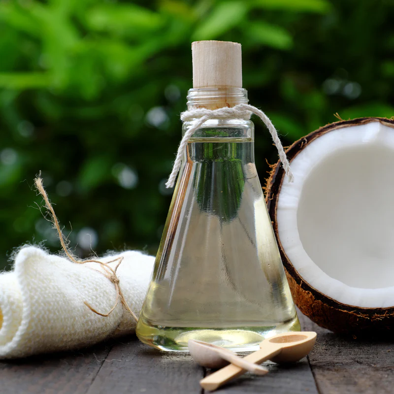

## Starting Owned Life

Back in 1999, when my husband and I moved to Berkeley, California, we were looking for a better life to start our own family. We believed that with our hard work mindset, we would be able to live our own dream, Jasmine Thai Cuisine. We were thrilled to see customers waiting in long lines to get lunch daily as a sign of success. And more important, we enjoyed spending more time with our children, while making enough money to live comfortably.

We thought everything was perfect, our business, our house, our cars, our favorite winter vacations, our favorite toys and gadgets, and our favorite foods. On the other hand, mortgage loans, health insurance, taxes, and all sort of bills, were attacking us all over. Like most Americans at that time, we had to work even harder every day. We did not think or care much about our health because we were told to trust the healthcare system.

We couldn't stop working when we were sick or worst yet, our children neither as they were helping us. From their birth, I'd taken many medicines that'd been told to protect them and myself. Like the one that induced delivery, and Epidural (the peridural in the spine) for Caesarean section while the fetus and mom had their own heart monitoring screens next to the bed. A few seconds right after they were born, they'd got some form of gel to put on their eyes then a few shots of protective liquid under their delicate skin layers.

We did our best out of the knowledge we had at that time. We produced and stored our frozen breast milk many times in a hiding spot at Jasmine Thai. All the BPA-free plastic and glass bottles were sanitized in the dishwasher with powerful soap. And as professional restaurant operators, sanitizing everything was the norm. Doctor visits for our children were just like a breeze, pediatricians were always nice. They gave us a lot of useful information on how to take care of our children. That was great because our parents were in Thailand, on the other side of the planet. By the end of each visiting session, they always offered us the protective liquid for our children, and it was free too. We never thought how dangerous we were living while spending time with children was the greatest thing in life. Our family's health depended only on medications.

I started to feel something in my heart. It sometimes had unusual beats. My husband felt tired and got sick very easily. My older boy was the center point because he had eczema, a hard time breathing at night, stomach flu every year, and no appetite. On the other hand, our younger boy was very strong and had a happy life like the other kids. We lived our hopeless life like this for a decade. Then there was big news came across the world that would change our family life forever.
